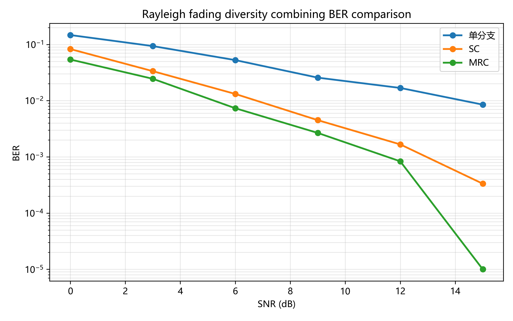
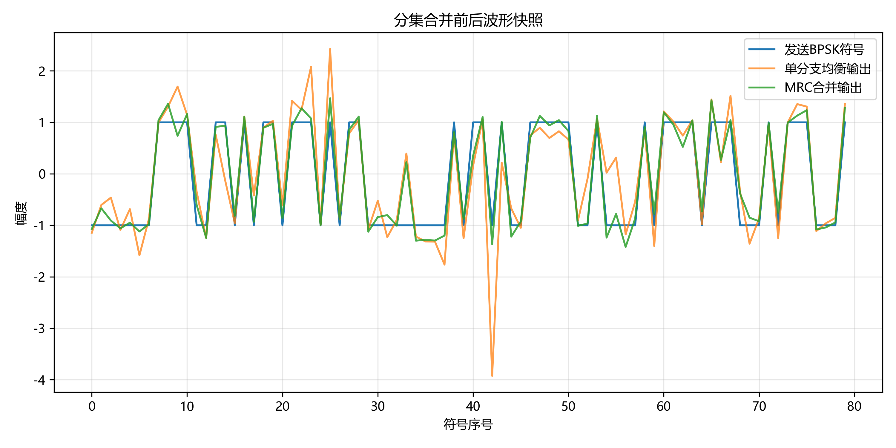
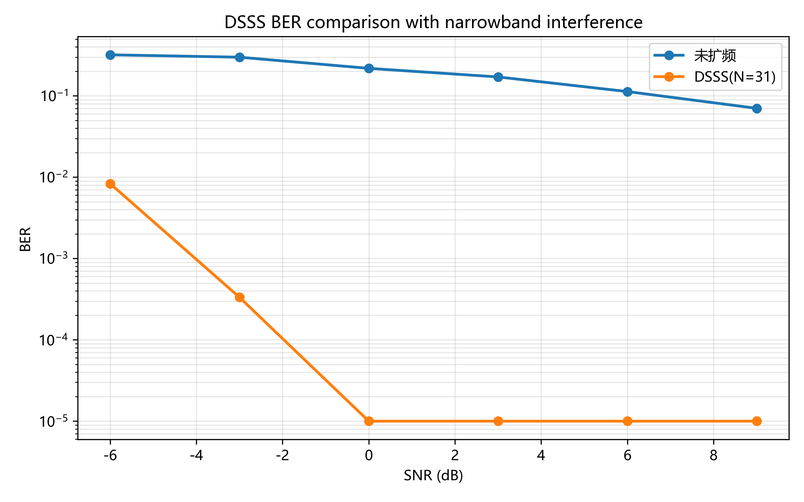
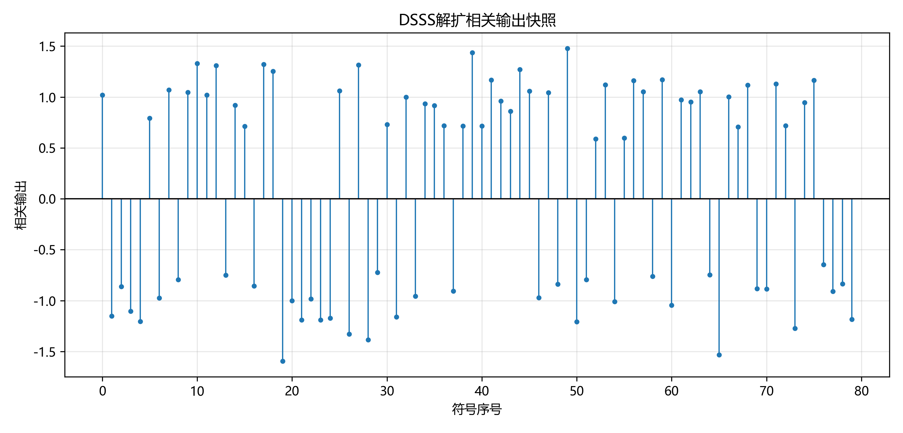

# 无线通信实验报告：分集与扩频通信

## 1. 实验目的

本实验围绕无线通信中的分集接收与直接序列扩频通信展开。实验目的包括：理解瑞利平坦衰落信道中深衰落会导致误码率升高的原因；掌握选择合并（SC）和最大比合并（MRC）的基本实现方法；掌握 m 序列的线性反馈移位寄存器生成规则；实现 DSSS 的扩频、解扩和处理增益计算；通过 BER 曲线观察分集阶数和扩频因子对系统可靠性的改善。

## 2. 实验原理

### 2.1 分集接收

在无线信道中，多径传播会让接收信号幅度和相位随机变化。瑞利衰落模型常用于描述没有直达径时的平坦衰落信道，某些时刻信道增益可能很小，从而出现深衰落。若只依赖单个接收分支，信号在深衰落处会被噪声淹没，误码概率明显增大。

分集技术通过多个独立衰落分支接收同一符号，降低所有分支同时深衰落的概率。选择合并（SC）对每个符号选择信道功率最大的分支，并用该分支信道系数均衡。最大比合并（MRC）使用各分支信道的共轭作为权重，将相位校正后的信号按信道强度加权求和：

```text
y_mrc = sum(conj(h_i) * r_i) / sum(|h_i|^2)
```

MRC 同时利用所有分支的能量，理论上通常优于只选择一个分支的 SC。

### 2.2 扩频通信

直接序列扩频（DSSS）把每个 BPSK 符号乘以一段高速 PN 码，使信号带宽扩大。接收端使用同一 PN 码相关解扩，期望信号会相干累加，而窄带干扰和噪声由于与 PN 序列相关性弱，会在解扩后被分散和平均。

m 序列由线性反馈移位寄存器生成。本实验约定寄存器从左到右编号，抽头为 1-based 位置，每拍输出最右端比特，反馈比特为抽头异或，并插入左端。输出比特映射为双极性码片：0 映射为 +1，1 映射为 -1。扩频因子为 N 时，处理增益为：

```text
G_p = 10 log10(N) dB
```

当 N=31 时，处理增益约为 14.91 dB。

## 3. 实验环境

- Python 版本：3.11.5
- 主要依赖：NumPy、Matplotlib、pytest、pylint
- 操作系统：Windows
- AI 使用说明：本实验使用 AI 助手辅助阅读评分脚本、实现 TODO 函数、运行测试并整理报告。核心算法均已通过本地 pytest 和实验脚本验证。

## 4. 实验方法

### 4.1 Part 1：分集接收

首先随机生成二进制比特并进行 BPSK 调制，其中 0 映射为 +1，1 映射为 -1。随后在多个独立瑞利平坦衰落分支上传输信号，并按给定 SNR 加入复高斯白噪声。

单分支方案直接对第一个分支做信道均衡。SC 方案对每个符号计算各分支的信道功率，选择 |h|^2 最大的分支，再除以对应的信道系数。MRC 方案对每个分支乘以信道共轭并求和，再除以总信道功率。最后对三种输出进行 BPSK 硬判决，并统计 BER。

选做部分实现了等增益合并（EGC）：先对每个分支做相位校正，再对校正后的分支求和并归一化。EGC 不像 MRC 那样按幅度加权，但可以利用多个分支的相位一致性获得分集增益。

### 4.2 Part 2：DSSS 扩频通信

首先用 LFSR 生成双极性 m 序列作为 PN 码。对每个信息比特进行 BPSK 映射后，乘以完整 PN 序列得到码片序列。信道中加入窄带余弦干扰和 AWGN，接收端将码片按扩频因子分组，并与同一 PN 序列相关。相关值非负判为 bit 0，相关值为负判为 bit 1。

实验同时比较未扩频 BPSK 与 DSSS 在窄带干扰下的 BER。选做部分实现了定时偏移搜索：在给定最大偏移范围内，逐个尝试对齐位置，选择平均相关幅度最大的偏移作为同步位置并输出解扩结果。

## 5. 实验结果

本次运行生成了以下四张结果图：









本地测试结果显示，Part 1 和 Part 2 的 12 个核心函数测试全部通过；运行实验脚本后，结果图文件均已生成。DSSS 中 N=31 时处理增益为 14.91 dB。

## 6. 结果分析

瑞利衰落会造成深衰落，是因为多径分量在接收端可能相消，使瞬时信道幅度接近零。此时即使平均 SNR 较高，某些符号仍可能落入很低的瞬时 SNR 区间，导致突发误码。

SC 与 MRC 的合并思想不同。SC 每次只选择最强分支，结构简单，复杂度低，但没有利用其他分支中的剩余能量。MRC 对所有分支进行相位校正并按信道强度加权，因此能够最大化合并后的输出信噪比。仿真曲线应表现为 MRC 的 BER 最低，SC 次之，单分支最高，且 SNR 越高差异越明显。

DSSS 的处理增益由扩频因子决定。扩频因子越大，每个信息符号对应的码片数越多，相关解扩时有用信号累加越充分，窄带干扰在解扩后被摊薄得越明显。本实验 N=31，因此理论处理增益为 10log10(31)=14.91 dB。BER 曲线中 DSSS 在窄带干扰下明显优于未扩频方案，符合理论预期。

## 7. 实验心得

通过本实验可以直观看到，分集和扩频都是提高无线链路可靠性的有效方法，但两者解决的问题角度不同。分集主要对抗衰落，通过多个独立分支降低深衰落同时发生的概率；扩频主要提升抗干扰能力，通过 PN 相关解扩获得处理增益。

代码实现中最需要注意的是数学约定要和测试一致。例如 MRC 必须使用信道共轭并按总功率归一化；m 序列的抽头编号、移位方向和输出端必须严格统一；DSSS 解扩时要按 PN 长度 reshape 后做相关判决。完成后再通过自动化测试和图像结果验证，能有效避免“看起来合理但约定不一致”的错误。

## 8. 参考资料

- 课程资料：分集接收相关章节
- 课程资料：扩频通信与 PN 序列相关章节
- 项目文档：README.md、docs/theory_diversity.md、docs/theory_spread_spectrum.md
